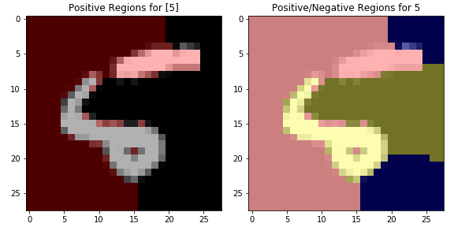
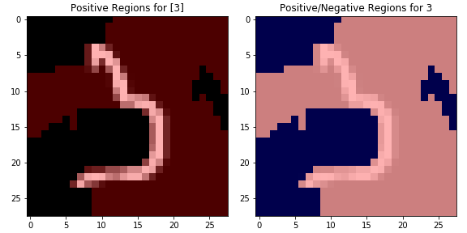
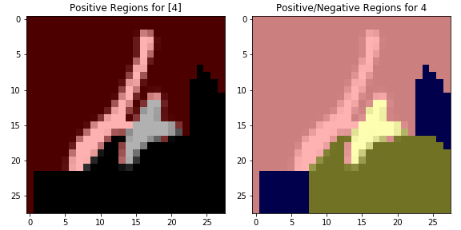
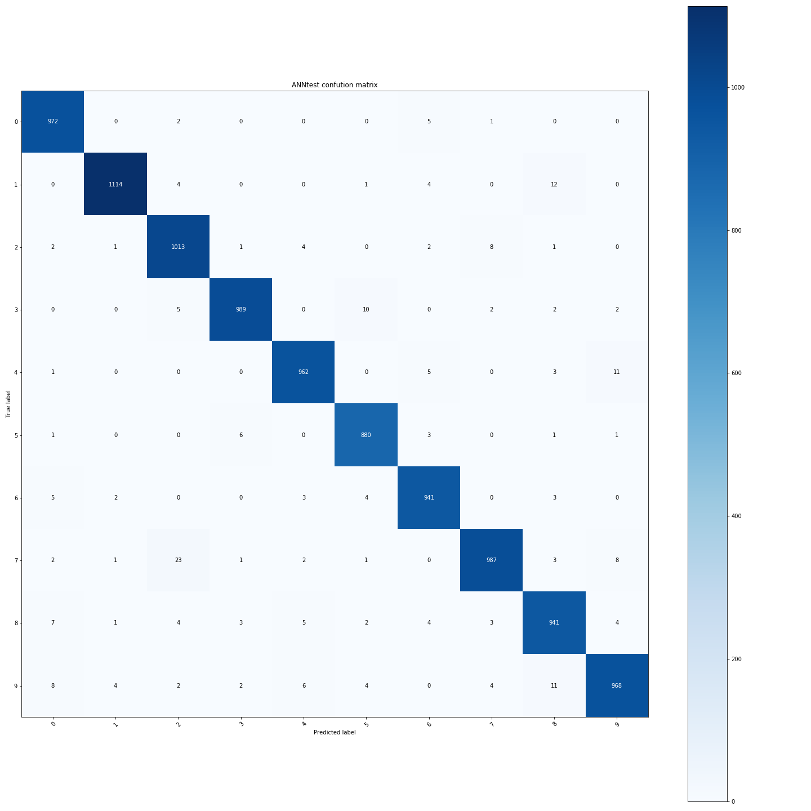
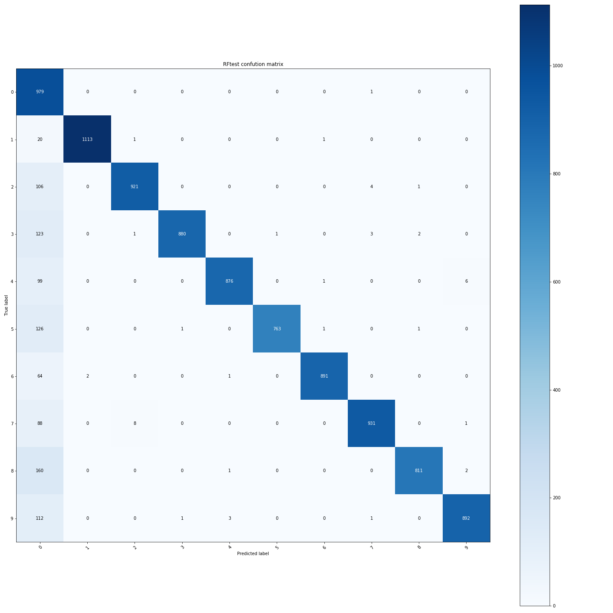
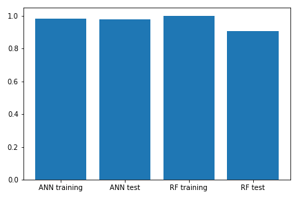

# Models Report
## Lime test
### Correct-Correct

true output: 7

#### ANN

filename: ANNtslime0.png

#### RF

filename: RFtslime0.png

### ANN Correct-RF Incorrect

true output: 7

#### ANN

filename: ANNtslime1.png

#### RF

predicted: 0

filename: 
* RFtslime1.png
* RFtslime4.png

### ANN Incorrect-RF Correct

true output: 7

#### ANN

predicted: 0

filename:
* ANNtslime2.png
* RFtslime5.png

#### RF

filename: RFtslime2.png

### ANN Incorrect-RF Correct

true output: 7

#### ANN

predicted: 0

filename: 
* ANNtslime3.png
* ANNtslime3.png

#### RF

predicted: 0

filename: 
* RFtslime6.png
* RFtslime7.png

## Confusion matrices

### ANN training

filename: ANNtrainconf.png

### ANN testing

filename: ANNtestconf.png

### RF training

filename: RFtrainconf.png

### RF testing

filename: RFtestconf.png

## Stats

### Acuracy

ANN acccuracy: 
* training: 0.9810333333333333
* test: 0.9767

RF accuracy:
* training: 1.0
* test: 0.9057

filename: acc.png

### Loss

ANN loss: 
* training: 0.001437908
* test: 0.0016805703
RF loss:
* training: 0.0
* test: 0.004905429

filename: loss.png
